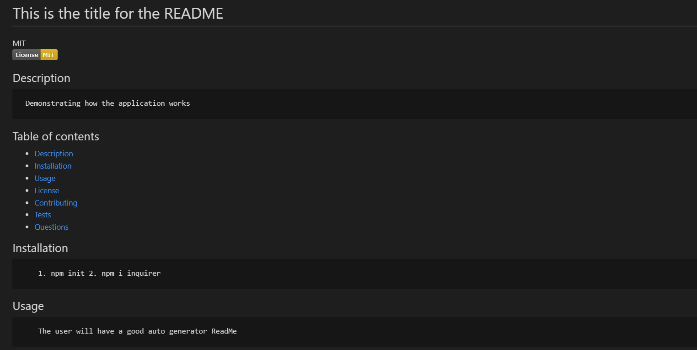
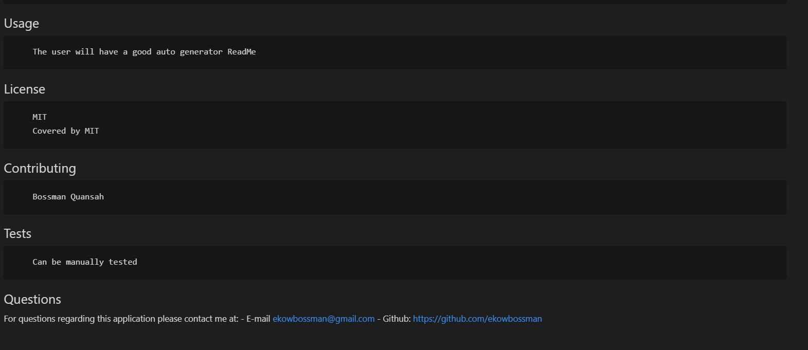

# This is the title for the README
MIT 
## Description 
     Demonstrating how the application works
## Table of contents
* [Description](#description)
* [Installation](#installation)
* [Usage](#usage)
* [License](#license)
* [Contributing](#contributing)
* [Tests](#tests)
* [Questions](#questions)
## Installation
        1. npm init 2. npm i inquirer 
## Usage 
        The user will have a good auto generator ReadMe
## License
        MIT
        Covered by MIT
## Contributing
        Bossman Quansah
## Tests
        Can be manually tested
## Questions
For questions regarding this application please contact me at:
    - E-mail ekowbossman@gmail.com
    - Github:
    <https://github.com/ekowbossman>

## 

## 
    